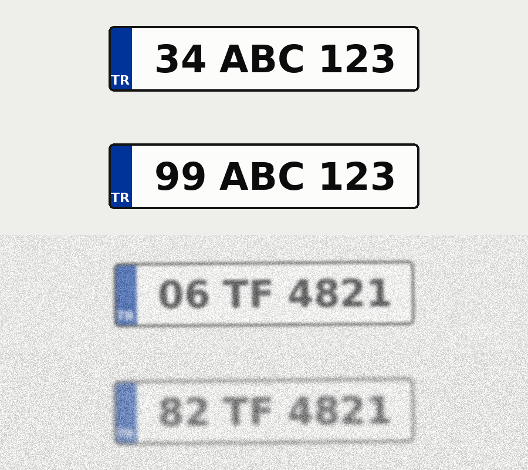
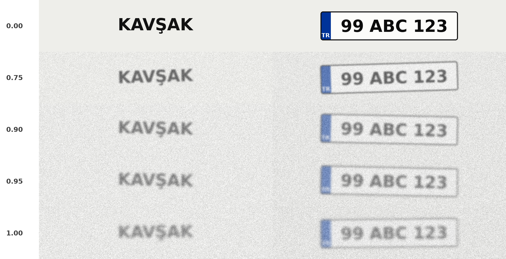
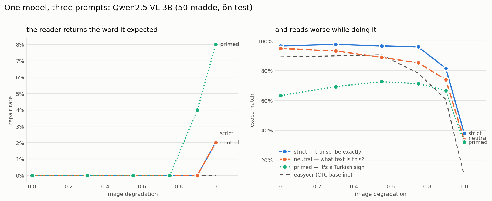
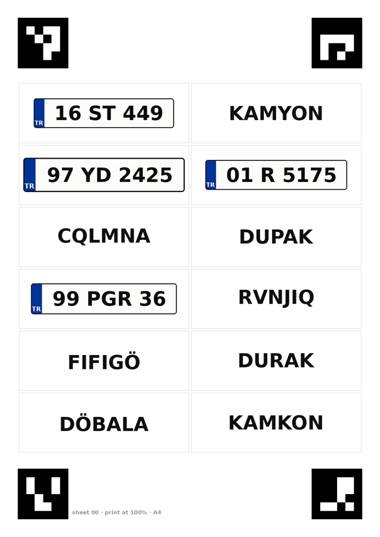
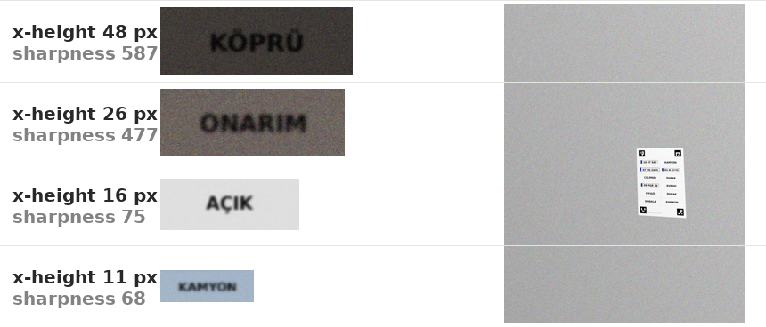

# Reads or guesses?

A generative OCR model that misreads a word tells you it failed. A generative OCR
model that *rewrites* it does not: the output is a well-formed word, spelled
correctly, arriving with the same confidence as every correct answer. In an
automatic annotation pipeline that is the worse failure by a wide margin, because
nothing downstream can see it.

This measures how often that happens, and what makes it happen.

## The instrument

Take a real word, swap one glyph for a visually distant one, and render both the
same way:

| shown | what a reader returns | what a guesser returns |
|---|---|---|
| `KAVŞAK` | KAVŞAK | KAVŞAK |
| `KAVBAK` | KAVBAK | **KAVŞAK** |

The swap is chosen so the pixels are unambiguous — Ş to B, not O to 0. A model
that returns `KAVŞAK` for the second image is not misreading a blurred glyph. It
is overriding a clear one with what it expected to see. The rate at which that
happens is the **repair rate**, and it is the number this repository exists to
produce.

Six conditions per item, all rendered with byte-identical degradation so that
only the linguistic plausibility of the string varies:

| condition | example | prior available |
|---|---|---|
| `word` | KAVŞAK | a real Turkish word |
| `perturbed` | KAVBAK | one glyph off a real word — the prior is *wrong* |
| `pseudo` | SÖBETÜ | Turkish phonotactics, not a word |
| `random` | XQKZMR | none |
| `plate_valid` | 34 ABC 123 | valid Turkish plate format |
| `plate_invalid` | 99 ABC 123 | invalid province code — structural prior is wrong |

The plate conditions are drawn as plates, not as text on a field:



That is not decoration. A structural prior — *99 is not a province, three letters
are never followed by five digits* — can only fire if the reader knows it is
looking at a plate, and a bare string does not say so. Letter and digit counts
are drawn from the real layout table (`99 X 9999`, `99 XX 999`, `99 XXX 99`, and
so on up to nine characters), and both arms span every layout, so the province is
the only thing separating a valid plate from an invalid one. `--plate-style text`
renders them bare, which turns the frame itself into a second axis.

Five degradation levels, from clean to barely legible. Degradation is applied by
downscaling and scaling back before blur and noise, because real OCR difficulty
is mostly small or distant text, and blur alone on a large glyph barely registers.



Every condition is set at the same point size, so the same difficulty means the
same pixels per character whatever the characters spell. That is the control the
whole benchmark rests on, and `test_stimuli.py` asserts it: a first draft of the
plate rendering sized the frame to the canvas and shrank the text to fit, which
made plate glyphs 1.6x taller than word glyphs. The plate conditions would have
scored better for having more resolution, and it would have read as a prior.

## What it measures

Beyond exact match and CER, four things that separate *how* a reader fails:

| metric | what it catches |
|---|---|
| **repair** | shown a perturbed word, returned the original — the invisible failure |
| **turkified** | added diacritics that were not in the image, making the string more Turkish than the pixels were |
| **diacritic loss** | dropped Ş, Ç, Ğ, Ü, Ö, İ — quiet, common, and meaning-changing in Turkish |
| **format compliance** | the answer arrived as the text, not wrapped in `The text in the image is "…"` |

Format compliance matters for a reason that is not academic: an answer that needs
parsing is an answer that can be parsed wrongly.

## Results

200 items × 6 conditions × 5 degradation levels = 6,000 images per configuration.
Six configurations: a CTC baseline, and two model sizes × three prompts.



| reader | exact | CER | format | **repair** | turkified | diacritic loss |
|---|---|---|---|---|---|---|
| EasyOCR (CTC) | 56.7% | 0.153 | 100% | **0.0%** | 1.0% | 13.6% |
| Qwen2.5-VL-3B · strict | 76.8% | 0.057 | 100% | 0.2% | 0.7% | 10.1% |
| Qwen2.5-VL-3B · neutral | 71.6% | 0.074 | **59%** | 0.3% | 1.1% | 10.9% |
| Qwen2.5-VL-3B · primed | 58.9% | 0.186 | 100% | 3.4% | 2.0% | 8.4% |
| Qwen2.5-VL-7B · strict | **83.9%** | **0.037** | 100% | 1.2% | 0.8% | 6.6% |
| Qwen2.5-VL-7B · primed | 49.5% | 0.294 | 100% | **7.1%** | **3.2%** | 4.3% |

Three prompts, the same images:

```
strict    Transcribe the text exactly as it appears… do not correct spelling.
neutral   What text is in this image?
primed    This is a Turkish road sign. Read the Turkish word on it.
```

### Prior-pull scales with the model

Repair rate, by how degraded the image is:

| degradation | EasyOCR | 3B strict | 3B neutral | 3B primed | 7B strict | 7B primed |
|---|---|---|---|---|---|---|
| 0.00 | 0.0% | 0.0% | 0.0% | 0.5% | 0.0% | **4.5%** |
| 0.75 | 0.0% | 0.0% | 0.0% | 0.0% | 0.0% | **6.5%** |
| 0.90 | 0.0% | 0.0% | 0.5% | 3.5% | 2.0% | **8.0%** |
| 0.95 | 0.0% | 0.0% | 0.0% | 3.0% | 1.5% | **7.0%** |
| 1.00 | 0.0% | 1.0% | 1.0% | **10.0%** | 2.5% | 9.5% |

The bigger model repairs more than the smaller one at every prompt — 1.2% against
0.2% under the strict prompt, 7.1% against 3.4% under the primed one. Whatever
makes 7B the better reader is the same thing that makes it the more confident
rewriter, and it does not show up in any accuracy number.

### The prior does not wait for the pixels to fail

A smaller model only overrides a glyph once the glyph stops being legible: 3B's
repair rate is zero everywhere until 0.90. The 7B model primed with a domain does
not wait. On **undegraded** images it repairs 4.5% of perturbed words:

```
shown PAPK      → PARK
shown ÇIKYŞ     → ÇIKIŞ
shown GEÇUŞ     → GEÇİŞ
shown ÇALYŞMA   → ÇALIŞMA
```

Nothing is blurred in those. The glyphs are 64pt and clean, and the model returns
a different word. This is the failure that an annotation pipeline cannot see, on
the images an annotation pipeline would consider easy.

### Priming does not degrade the task — it replaces it

Told *"this is a Turkish road sign, read the Turkish word on it"*, the 7B model
scores **0.1%** on plates. Not misread — obeyed:

| shown | 7B primed returns |
|---|---|
| `01 PEY 114` | `PEY` |
| `35 MPZ 421` | `MPZ` |
| `90 ECJ 946` | `ECJ` |

It finds the only word-shaped token on the plate and hands it back. On plates
drawn with the blue band it returns `TR`. The 3B model does the same thing more
mildly (34.7%). One sentence of well-meant context turned an OCR engine into a
word detector, and every output was well-formed.

### The frame helps the model and hurts the pipeline

The plate conditions were run twice: as bare strings, and drawn as plates.

| reader | `plate_valid` bare | drawn | band read as text |
|---|---|---|---|
| EasyOCR (CTC) | 71.9% | 67.9% | **19.9%** |
| 3B strict | 86.7% | **90.7%** | 3.0% |
| 3B neutral | 74.6% | **84.6%** | 0.1% |
| 7B strict | 89.8% | **91.1%** | 1.7% |

Drawing the frame helps every VLM — up to 10 points for the neutral prompt — and
costs the CTC reader, which reads the country band as part of the registration on
a fifth of all plates (`34 ABC 123 TR`). Those readings are scored after the band
is removed; the column is what the raw output looked like. If you run a detector
plus recogniser over plate crops, that is a real 20% contamination rate on a
string that was otherwise read perfectly.

### The structural prior never fires

The headline conditions of this benchmark, `plate_invalid`, produced almost
nothing: correcting an invalid province code into a valid one happened at **0.0%
to 0.9%** in every configuration, both renderings, at every difficulty. The
lexical prior is strong enough to override clear pixels; the structural one is
not, or is not represented at all. That is a negative result and it is reported as
one — a model that knows Turkish words evidently does not, in the same way, know
Turkish province codes.

### Word errors in Turkish are mostly diacritics

`random` — six letters, no diacritics, no prior whatsoever — is read *better* than
`word` by every VLM (81.4% against 73.0% for 3B strict). The word conditions are
not harder because of ambiguity; they are harder because they contain Ş, Ç, Ğ, Ü,
Ö and İ, and 7–26% of readings drop one. In Turkish that changes the word.

## The real-image half

Synthetic renderings are cleaner and more uniform than a photograph, so the same
measurement runs on printed sheets. **[docs/sheets.pdf](docs/sheets.pdf)** is the
printable stimulus — four A4 pages, twelve cells each, two items across all six
conditions:



A photograph cannot be counterfactual on its own: there is no picture of a sign
that says `KAVBAK`, and editing one into a real photo replaces the thing being
controlled. So the matching moves into the capture. Every condition is printed on
the same sheet and photographed in one frame, which makes illumination, focus,
motion blur, exposure, white balance and sensor noise identical across conditions
*by construction* — they are the same photograph. Distance and lighting become the
difficulty ladder and vary between photographs rather than within them.

The four ArUco markers turn crop extraction into a homography rather than an
annotation job. `extract.py` finds them, rectifies the sheet to the geometry
`sheets.py` recorded, and cuts each cell at coordinates fixed before the shutter —
so no box is drawn by hand and no expectation about the text can nudge one.

```bash
python sheets.py --sheets 4 --out sheets      # writes sheets/sheets.pdf and its manifest
python simulate_capture.py --sheets sheets/ --out photos_sim/    # dry run, no printer
lp sheets/sheets.pdf                          # print at 100% scale, no fit-to-page
# ... photograph the printed sheets into photos/ ...
python extract.py --photos photos/ --sheets sheets/ --out real/
python run.py --reader qwen-vl --stimuli real --prompt strict --out predictions_real/qwen.json
```

Print **`sheets/sheets.pdf`**, the copy that sits next to the manifest that made
it — not `docs/sheets.pdf`, which is only a preview. The manifest is what turns a
photograph into labels, so a page printed from one seed and extracted with another
would mislabel every crop and raise nothing. Each page carries its seed in the
footer for that reason. Generation is deterministic: the same `--seed` and
`--sheets` reproduce the same pages byte for byte.

**Capture protocol** — 4 distances × 4 lighting conditions × 4 sheets = 64 photos,
768 crops. Name each file `sheet00_0p8m_daylight.jpg`; the sheet index comes from
the filename, everything else from the markers.

| distance | sheet in a 3024 px frame | glyph height | note |
|---|---|---|---|
| 0.5 m | 959 px | ~36 px | comfortable for any reader |
| 0.8 m | 599 px | ~22 px | where the CTC reader starts to lose |
| 1.2 m | 399 px | ~15 px | daylight and shade only |
| 1.8 m | 266 px | ~10 px | daylight only |

Those numbers are geometry, not guesswork: a 26 mm-equivalent phone lens sees
1.32 m of width per metre of distance, so an A4 sheet at 4 m is 120 px wide and
its glyphs are four pixels tall. An earlier draft of this protocol asked for 1, 2,
4 and 6 m — half of those distances would have produced nothing but unreadable
crops, and the way that was caught is in the next section.

Lighting: daylight · shade · indoor · low light. Keep the sheet flat with all four
markers in frame; a slight angle is fine and the homography absorbs it. **Skip low
light past 1 m** — the markers themselves stop decoding before the text does, and
the whole photograph is lost rather than just the hard cells.

Difficulty is measured rather than set: each crop carries `x_height_px`, RMS
`contrast` and Laplacian `sharpness`. Those are proxies, so they get validated
against the CTC reader — it never repairs, so its accuracy is legibility
uncontaminated by priors. If accuracy falls as the proxies say difficulty rises,
the axis is real and the VLM's repair rate can be read against it.

Print scaling must be 100%: the marker separation is the ruler the extractor
measures everything else against. And the plate cells are printed plates, not
photographs of real ones — a real plate is personal data, and more to the point it
cannot carry an invalid province code, which is the entire condition.

### Validating the capture path before spending 64 photographs

The extraction path — marker detection, homography, cell cutting, legibility
measurement — is the part of this benchmark most likely to be quietly wrong, and
after the photographs are taken is an expensive time to find out. So the sheets
go through a camera model first: `simulate_capture.py` places each page at a
distance in a 12 MP frame, tilts it, lights it unevenly, blurs it, adds sensor
noise and JPEG artefacts.



**This is not a result on photographs and is not reported as one.** It is honest
about geometry — a real phone at these distances does produce glyphs of these
pixel heights — and dishonest about optics, paper, print texture and motion. Its
job is to break the pipeline before the pipeline costs anything.

It did, twice:

- **The distances in the first draft of the protocol were wrong.** 1, 2, 4 and
  6 m. At 4 m an A4 sheet is 120 px wide in the frame and its glyphs are four
  pixels tall. Half the shoot would have produced unreadable crops. The table
  above is the corrected version.
- **Markers fail before text does.** Five of 64 frames yielded zero usable
  crops, and every one of them was low light at 1.2 m or further: the ArUco
  squares stopped decoding while the words in the same frame were still legible.
  A lost marker costs the whole photograph, not the hard cells — hence "skip low
  light past 1 m".

59 of 64 frames extracted, 708 crops, measured x-heights from 4 to 49 px. Running
the readers over them says the legibility proxy is doing its job — accuracy tracks
measured glyph height, monotonically, for every reader:

| reader | 0–8px | 8–12px | 12–18px | 18–26px | 26px+ |
|---|---|---|---|---|---|
| | *n=20* | *n=43* | *n=225* | *n=186* | *n=234* |
| EasyOCR (CTC) | 10% | 5% | 22% | 50% | **57%** |
| 3B strict | 80% | 53% | 69% | 87% | **89%** |
| 7B strict | 80% | 81% | 80% | 88% | **89%** |
| 3B primed | 30% | 30% | 57% | 70% | **70%** |
| 7B primed | 20% | 26% | 50% | 62% | 57% |

The two smallest bands hold 20 and 43 crops and are noise. Across the three that
matter the axis is clean, which is what the CTC reader was there to establish: it
has no prior to fall back on, so its accuracy *is* legibility.

And the effect this repository measures survives the trip through a camera model,
larger than it was on clean renderings:

| reader | exact | CER | **repair** | `plate_valid` |
|---|---|---|---|---|
| EasyOCR (CTC) | 39.6% | 0.307 | **0.0%** | 50.0% |
| 3B strict | 79.7% | 0.079 | **0.0%** | 81.4% |
| 7B strict | **85.3%** | **0.053** | **0.0%** | **89.8%** |
| 3B primed | 62.6% | 0.246 | 2.5% | 22.9% |
| 7B primed | 53.2% | 0.317 | **10.2%** | 3.4% |

Repair by measured glyph height, 7B primed: 2.6% at 26px+, 10.8% at 18–26px,
16.7% at 12–18px, 20.0% at 8–12px. Under the strict prompt it is 0.0% in every
band, at both model sizes — the recommendation survives the harder images too.

The one thing that changed direction: perspective and uneven lighting cost the
CTC reader far more than the VLMs. EasyOCR falls from 56.7% on flat renderings to
39.6% here; 7B strict goes *up*, 83.9% to 85.3%. A CTC pipeline is safe from
hallucination and fragile to everything else.

## What to do with this

For an annotation pipeline that uses a VLM as an OCR engine:

1. **Do not prime the model with domain context.** It is the single most costly
   thing measured here, in both accuracy and hallucination, and the damage grows
   with model size: the primed 7B model scored 0.1% on plates and repaired 7.1%
   of perturbed words.
2. **Constrain the output format explicitly.** The strict prompt was best on
   every axis, including the ones it was not aimed at.
3. **Do not assume a bigger model is a safer one.** 7B strict reads better than
   3B strict by seven points and repairs six times as often. Accuracy and
   prior-pull rose together, and only one of them was visible in the metrics.
4. **A legibility estimate is a useful trigger, not a sufficient one.** For the
   3B model, repair is zero until the text stops being legible. For 7B primed it
   is 4.5% on clean images. Routing only the blurry crops to review would have
   caught none of those.
5. **Consider disagreement as a flag.** A CTC reader and a VLM fail in different
   directions. Where they disagree is where one of them is guessing — and the
   CTC reader never repaired once in 36,000 readings.
6. **Strip the country band before comparing plate strings.** A detector plus
   recogniser returned it as part of the registration on 19.9% of drawn plates.

## Running it

```bash
pip install -r requirements.txt

python stimuli.py --items 200 --out stimuli          # --plate-style text for bare plates
python run.py --reader easyocr --out predictions/easyocr.json
python run.py --reader qwen-vl --prompt strict --out predictions/qwen-strict.json
python score.py predictions/*.json --json report.json
python chart.py --report report.json
python test_stimuli.py                              # the generator's own checks
```

The plate arm re-runs only the two plate conditions, so it is a third of the
work and directly comparable to the full run:

```bash
python stimuli.py --items 200 --out stimuli_plate --conditions plate_valid plate_invalid
python run.py --reader qwen-vl --stimuli stimuli_plate --prompt strict \
    --out predictions_plate/qwen-3b-strict.json
python score.py predictions_plate/*.json --json report_plate.json
```

Stimulus generation needs nothing but Pillow and NumPy. Each reader pulls its own
dependencies only when used.

## Prior work

The counterfactual-perturbation method is not new. [Do VLMs Read or
Rewrite?](https://arxiv.org/html/2607.21617), [Reading or
Guessing?](https://arxiv.org/pdf/2605.27750) on Ancient Greek editions, and
[Visual Merit or Linguistic Crutch?](https://arxiv.org/html/2601.03714v2) on
DeepSeek-OCR all establish that end-to-end models lean on language priors where
pipeline OCR does not.

What is added here: the measurement in **Turkish**, where agglutination makes the
space of plausible strings enormous and the diacritics give a second, quieter
failure mode; the **licence-plate** conditions, where the prior is structural
rather than lexical; the **prompt as an experimental variable** rather than a
fixed detail; and a framing aimed at the person running an annotation pipeline
rather than at the leaderboard.

## What this is, and what it isn't

It **is** a controlled measurement with matched stimuli and a reproducible
generator.

It **is not** a claim about VLMs in general: it tests two model sizes from one
family, at one point in time, on synthetic renderings. Synthetic text is cleaner
and more uniform than a photograph of a sign, which is what `sheets.py` and
`extract.py` exist to fix — printed sheets, photographed at four distances under
four lighting conditions, with every condition inside the same frame.

Repair rates in the low single digits rest on 200 perturbed items per difficulty
level. The direction is consistent — across both model sizes, all three prompts
and every difficulty — but a cell reading 1.5% and one reading 2.0% are not
distinguishable at this sample size. The differences the results lean on are the
large ones: 0.2% against 7.1%, 90% against 0.1%.

## Licence

MIT.
